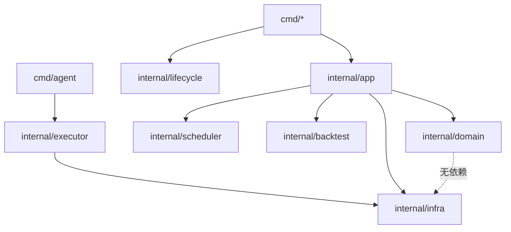

# AltShort 架构（骨架阶段）

## 进程

- **SaaS**（`cmd/saas`）：控制面、策略编排与对外的 API/WS 服务端（后续 Phase）；通过 **不包含** 交易所秘密的配置启动。
- **Agent**（`cmd/agent`）：唯一适合持有 **Binance API Key** 的进程；负责连接交易所、下单、心跳与对 SaaS 的反向注册/推送。
- **Backtest**（`cmd/backtest`）：离线回放，与实盘共享策略调用形状（`Step()` 及输入输出契约）。

## 分层（依赖方向）

- **domain**：纯数据与纯函数契约；不依赖 `infra`。  
- **executor**：把领域指令变成交易所 API 调用；**不写策略 alpha**。  
- **infra**：GORM、日志、第三方客户端；库表用 `AutoMigrate`，不用 SQL migration 文件。

## 后续 Phase 入口建议

1. domain：定义 `Step` 输入/输出与归一化约定。  
2. backtest：最小事件循环 + 假数据驱动一次 `Step`。  
3. agent：配置模型 + executor 接口 + WS 协议草案（仍可无真实交易）。
