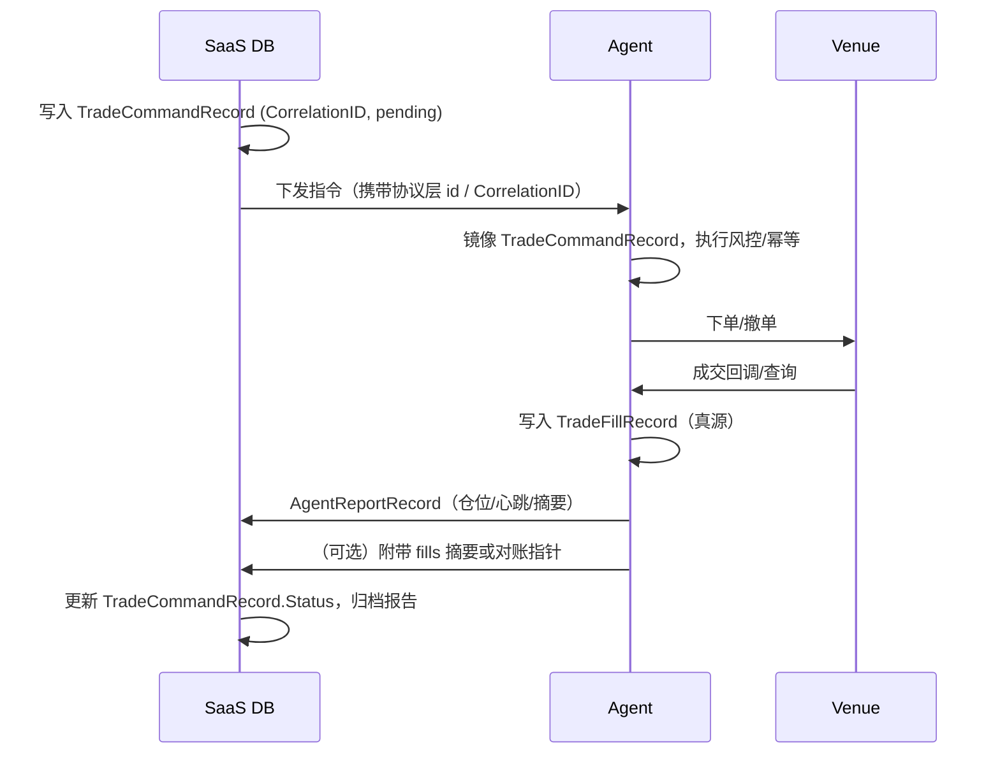

# 数据归属与真源（Data ownership）

本文档说明 AltShort 在 **SaaS 控制面** 与 **Agent 执行端** 之间的数据库真源划分、命令—回报闭环，以及进程重启后的恢复语义。表结构由 `internal/infra/db/models` 的 GORM 模型与 `AutoMigrateAll` 维护；**不使用 SQL migration 文件**。

## 进程与数据库文件

- **SaaS**（`cmd/saas`）：默认使用 `configs/saas.yaml` 的 `database.dsn` 指向的库（空则启动时内存 SQLite，仅适合开发）。
- **Agent**（`cmd/agent`）：默认使用 `configs/agent.yaml` 的 `local_store.sqlite_dsn`（空则为内存 SQLite）。

两进程可运行 **同一套模型** 与 **同一 `AutoMigrateAll` 列表**；在实际部署中应使用 **不同的 DSN/文件**，避免双写。单元测试与本地可共用内存库作烟雾验证。

## SaaS 真源（控制面权威）

以下实体以 **SaaS 库中的记录** 为计划与审计层面的真源（Agent 不应反向覆盖这些权威状态，除非经明确对账协议）：

| 模型 | 表语义 |
|------|--------|
| `User` | 用户/租户根 |
| `Strategy` | 策略定义与版本化参数快照（JSON）；**策略计算仍在 domain 纯函数，不在表内** |
| `Instance` | 用户、策略与 `AgentKey` 的编排绑定 |
| `StrategyRun` | 运行周期 ID 与生命周期（pending/running/…） |
| `TradeCommandRecord` | 下发指令、幂等键 `CorrelationID`、派发与 ack 状态 |
| `MarketSnapshot` | 控制面采纳并落库的市场快照（可来自 Agent 上报或外部行情） |
| `LPPLScanResult` | 离线/准实时分析结果归档 |
| `AgentReportRecord` | **内容上**由 Agent 生成，**控制面库中本表**为「已接收报告」的审计与展示真源 |
| `WSSession` | SaaS 进程视角的入站会话观测（`scope=saas_inbound`） |
| `AuditEvent` | 控制面动作审计 |

## Agent 真源（执行与场所对账）

以下实体以 **Agent 库中的记录** 为执行与场所事实层面的真源：

| 模型 | 表语义 |
|------|--------|
| `TradeFillRecord` | 成交/填充；以 `Venue` + `VenueTradeID` 唯一约束去重，支撑与交易所对账 |
| `TradeCommandRecord`（镜像） | 已接收指令副本与本地状态机；**以 SaaS 指令流为权威来源**，重启后通过对账/重放对齐 |
| `WSSession` | Agent 进程视角的出站连接观测（`scope=agent_outbound`） |

Agent **不**持有 `User` / `Strategy` 等业务主数据的权威副本；恢复时通过连接 SaaS 与 `AgentKey` 拉取绑定关系（后续 Phase 在应用层实现）。

## 非数据库真源：仅缓存/内存

以下 **不得**作为系统真源（本仓库占位字段 `BootstrapDeps.Cache`、进程内 map、WS 内存态等）：

- Redis / 进程内 LRU 等 **缓存**（仅加速、可丢）。
- WebSocket **当前连接对象**（以 `WSSession` 行作持久观测，而非连接的 Go 值）。
- 未落库的临时计算结果。

## 命令与回报闭环

闭环要点：

1. **指令幂等**：`TradeCommandRecord.CorrelationID` 在 SaaS 侧唯一；Agent 侧以同一键去重应用。
2. **成交真源**：以 Agent 落库的 `TradeFillRecord` 为准；SaaS 展示层消费报告或异步同步，不凭空生成成交。
3. **状态推进**：指令从 `pending` → `dispatched` → `acked` / `failed`；与 `AgentReportRecord` 交叉验证由应用层完成，不在 repository 内做策略判断。

## 重启后如何恢复状态

| 进程 | 恢复入口 |
|------|----------|
| **SaaS** | 读取数据库：`User` / `Strategy` / `Instance` / `StrategyRun` / 未完成 `TradeCommandRecord`；重绑 WS 与调度；内存缓存可空。 |
| **Agent** | 打开本地 SQLite，读取镜像指令与 `TradeFillRecord`；连接 SaaS 后按 `Instance.AgentKey` 对齐实例与待处理命令；对账 venue 开放订单与成交；重建 WS（`WSSession` 仅辅助排障）。 |

**注意**：若 Agent 使用默认内存 DSN，重启即丢失本地镜像与成交缓存，必须通过 SaaS + Venue 重新拉齐——生产应使用文件 DSN。

## 软删除策略摘要

- **支持软删除**（`deleted_at`）：`User`、`Strategy`、`Instance`。
- **不软删**（事实/流水型）：`StrategyRun`、`MarketSnapshot`、`LPPLScanResult`、`TradeCommandRecord`、`TradeFillRecord`、`AgentReportRecord`、`WSSession`、`AuditEvent`。

## 相关代码

- 模型：`internal/infra/db/models/`
- 迁移：`internal/infra/db/migrate.go` → `AutoMigrateAll`
- 启动挂载：`internal/app/bootstrap.go`（SaaS 与 Agent 在打开 DB 后自动迁移）
- 仓储骨架：`internal/infra/db/repository/`
