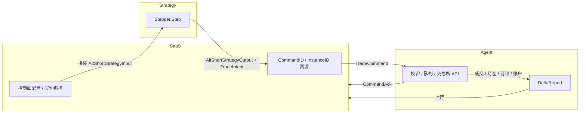

# Domain model (frozen structs & interfaces)

本文描述 AltShort 已冻结的领域类型边界与数据流向；实现细节与持久化不属于本文范围。

## 数据流向

文字链路：**SaaS（编排与 id 分配）→ 构造策略输入快照 → `Stepper.Step` 纯函数 → 产出 `TradeIntent` → 实例化为 `TradeCommand` 下发 Agent → Agent 执行并回传 `CommandAck` 与 `DeltaReport`（成交、未成交单、持仓、权益与保证金等）→ SaaS 收敛展示与风控。**

## 真源与快照

| 类别 | 对象示例 | 真源归属 | 说明 |
|------|-----------|----------|------|
| 控制面 | `TradeCommand.{CommandID, InstanceID, StrategyID}`、`InstanceState.Lifecycle` | **SaaS 真源** | 标识与生命周期由编排器分配与驱动。 |
| 策略纯计算 | `AltShortStrategyInput` / `AltShortStrategyOutput` | **无持久真源** | 每步快照输入/输出；可落日志与回测，非账户事实。 |
| 执行与账户事实 | `FillRecord`、`OpenOrderSnapshot`、`PositionSnapshot`、`AccountSnapshot`、`DeltaReport` | **交易所经 Agent 归一化真源** | Agent 从 venue 拉取或推送解析，SaaS 持有副本。 |
| 短时可观测 | `CommandAck`、`ReportAck`、`AuthResult` | **对端回执真源** | _ack 由接收方生成；用于协议层确认。 |
| 聚合查询 | `SystemStateSnapshot`、`ExecutionStateSnapshot`、`MarketStateSnapshot` | **多数为缓存快照** | 由调度器或查询层从上述真源折叠；行情亦可来自独立行情缓存。 |

策略侧的 `RiskSnapshot` 与特征字段为 **只读输入**：控制面/风控与特征管线将 SaaS 配置与（经 Agent 同步的）账户事实裁剪后注入 Step，不在 domain 层写实现。

## 子包索引

- `internal/domain` — `Bar`、`Side` 等跨子域原语
- `internal/domain/strategy` — `Stepper`、`AltShortStrategyInput` / `Output`、特征与风险快照
- `internal/domain/command` — `TradeCommand` 与 ack/状态枚举
- `internal/domain/report` — `DeltaReport` 与成交/挂单/持仓/账户结构
- `internal/domain/instance` — 实例/策略/Agent 状态边界
- `internal/domain/auth` — WebSocket 握手与 `AuthScope`
- `internal/domain/state` — 系统级聚合快照

Canonical 约束仍参见仓库根目录 `CLAUDE.md` 与 `AGENTS.md`。
